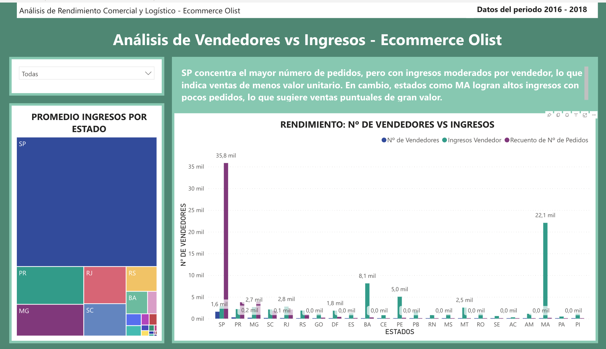
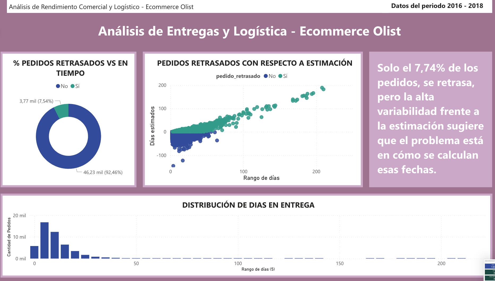
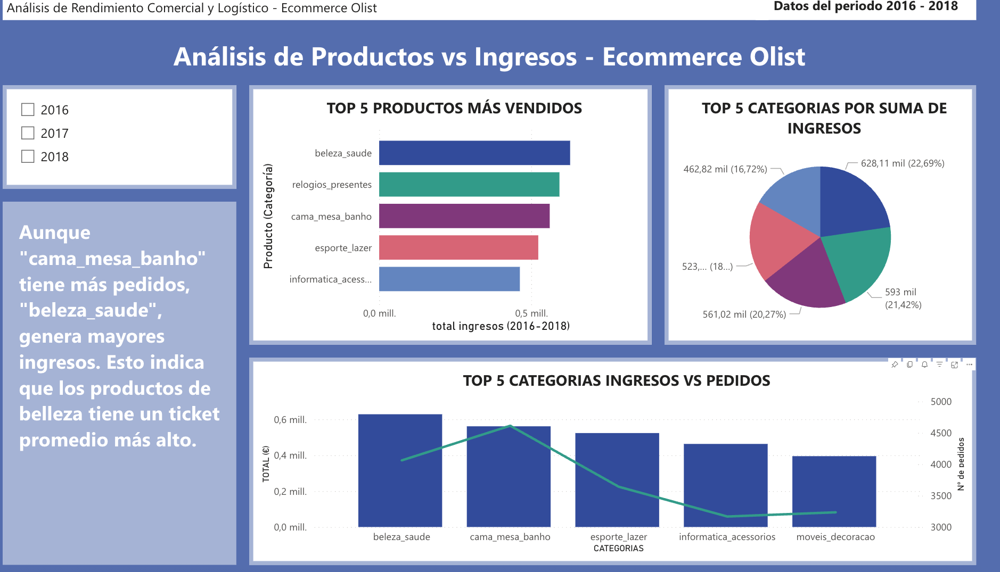
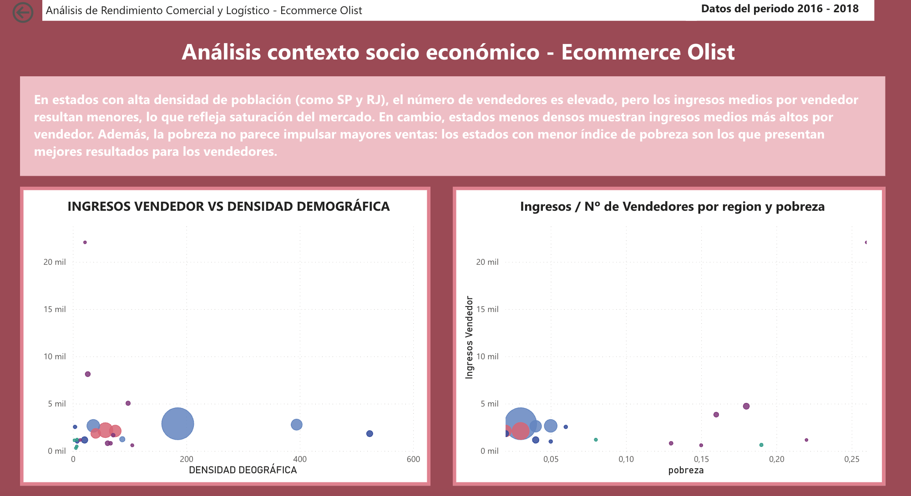

# 📊 Proyecto de Análisis de Datos - E-commerce Olist

## 🚀 Introducción
Este proyecto se centra en el análisis exploratorio de datos (EDA), la transformación y limpieza de múltiples fuentes de datos, y la construcción de un dashboard operativo en **Power BI** que aporta valor a la toma de decisiones.  
El análisis gira en torno a los datos de ventas de la plataforma brasileña **Olist** y se enriquece con información socioeconómica de los estados de Brasil.

---

## 📂 Fuentes de datos
Se utilizan **dos fuentes principales** de datos, cumpliendo el requisito de diversidad:

1. **Dataset Olist** (`olist_orders_dataset.csv`, `olist_order_items_dataset.csv`, `olist_products_dataset.csv`, `olist_sellers_dataset.csv`)  
   - Datos transaccionales: pedidos, vendedores, productos, precios, logística.  

2. **Dataset Socioeconómico de Estados de Brasil** (`states.csv`)  
   - Variables: `population`, `poverty`, `demographic_density`, `gdp_per_capita`, `region`.  

Estos conjuntos se unieron para obtener una visión integral que combina rendimiento comercial con características socioeconómicas.

---

## 🛠️ Transformación y Dataset Final
- Se procesaron los datasets en los notebooks `01` y `02` (limpieza y transformación).  
- Se generó el archivo final:  
  **`olist_final_dataset.xlsx`** con más de **50.000 filas** y **34 columnas**.  
- Operaciones realizadas:
  - Normalización de fechas.  
  - Cálculo de métricas: `precio_total`, `dias_entrega`, `es_tarde`.  
  - Unión con `states.csv` para enriquecer con datos socioeconómicos.  
  - Creación de nuevas columnas derivadas (mes, día, retraso estimado, etc.).

---

## 🔍 EDA y Análisis Estadístico
- **Descriptivo:** distribución de pedidos, ingresos, entregas y productos más vendidos.  
- **Estadístico:** correlaciones entre variables logísticas y retrasos.  
- **KPIs clave identificados:**
  - Total de ingresos.  
  - Nº de pedidos.  
  - % de pedidos retrasados.  
  - Revenue por vendedor.  

---

## 📊 Dashboard en Power BI
El proyecto culmina en un **dashboard interactivo** publicado en Power BI Service:  

🔗 [Ver Dashboard en Power BI](https://app.powerbi.com/groups/me/reports/172250f4-cd43-4fc7-b351-e629442ca5c2/08c530d1085cabd25c37?experience=power-bi)

### Capturas del dashboard

1. **Análisis Global**  
   

2. **Vendedores vs Ingresos**  
   

3. **Entregas y Logística**  
   

4. **Productos vs Ingresos**  
   

5. **Contexto Socioeconómico**  
   

---

## 📝 Informe del análisis
**Pregunta de negocio planteada:**  
➡️ ¿La concentración de vendedores y sus ingresos medios se relacionan con factores socioeconómicos como la densidad de población o la pobreza?

**Insights principales:**
- En estados densamente poblados (ej. SP y RJ) hay más vendedores, pero el ingreso medio por vendedor es menor → saturación de mercado.  
- En estados con menor densidad, los vendedores capturan mayores ingresos medios.  
- La pobreza no se relaciona positivamente con los ingresos: los estados con menor índice de pobreza presentan mejores resultados.  

**Otros hallazgos:**
- La categoría *beleza_saude* tiene ticket medio más alto pese a menos pedidos.  
- Solo un 7,63% de pedidos sufren retrasos, aunque la variabilidad de plazos sugiere mejorar la estimación de fechas.  
- El crecimiento de ingresos es sostenido hasta mediados de 2018 (datos incompletos posteriores).  

---

## 📁 Organización del repositorio
